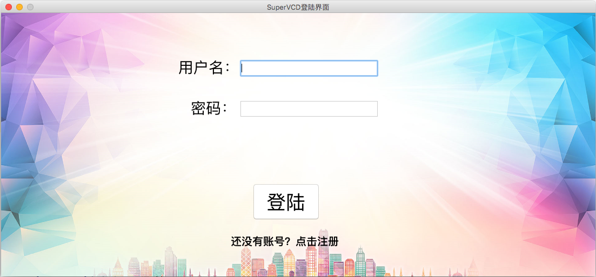
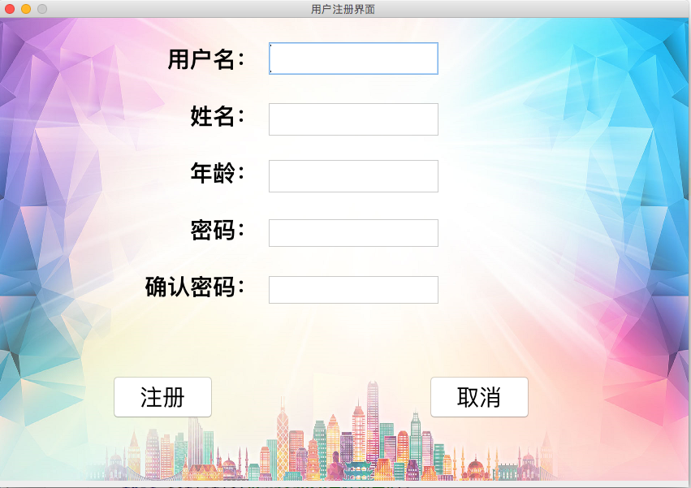
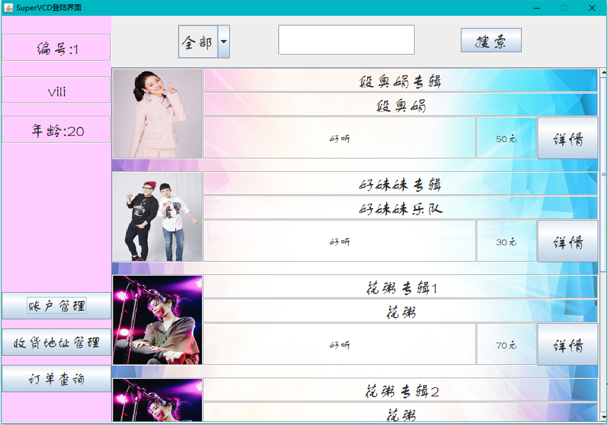
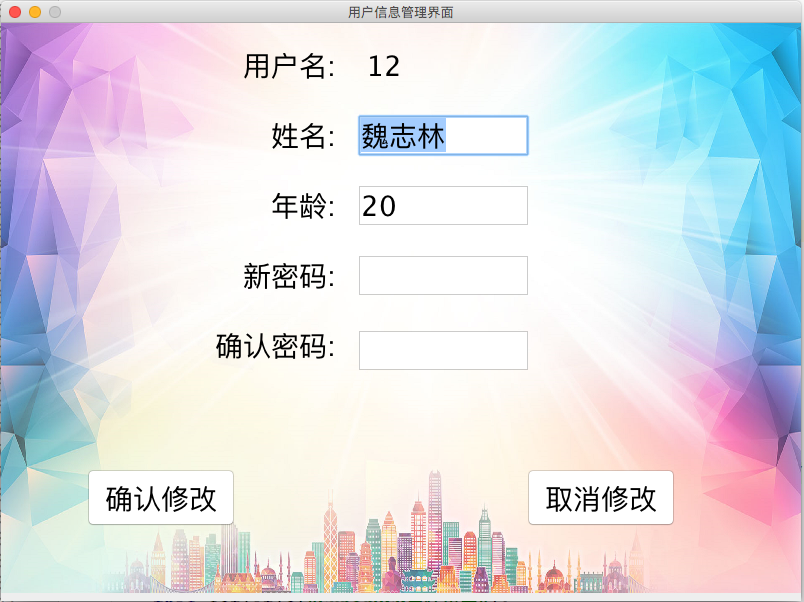
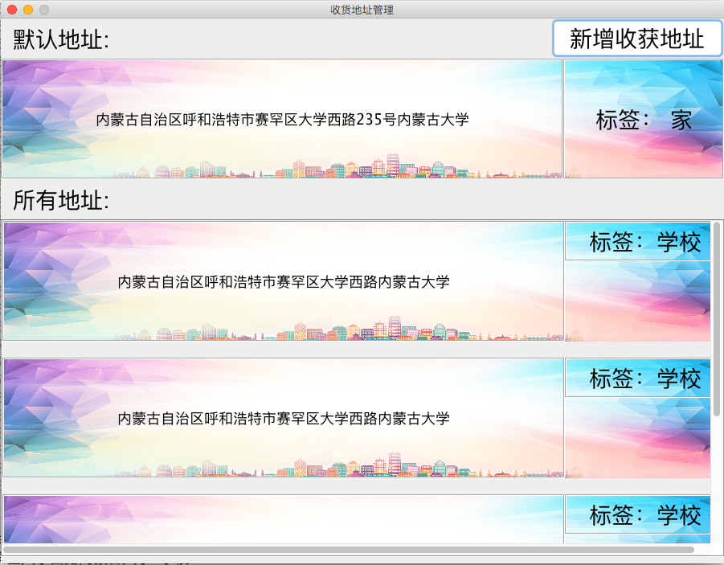
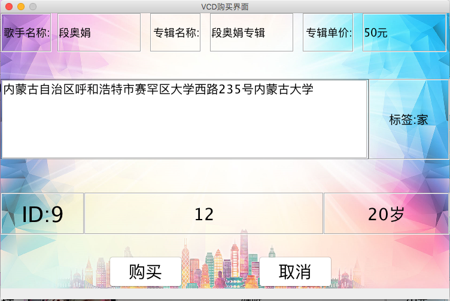
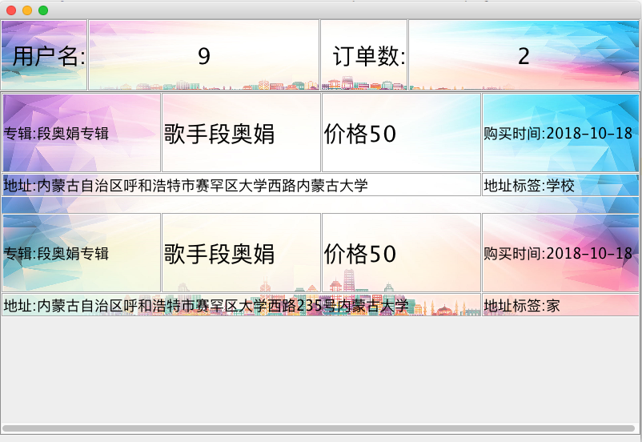

# VCD售卖系统

**作者：积极向上小木木 &nbsp;&nbsp;&nbsp;&nbsp;&nbsp;&nbsp;&nbsp; 联系方式：PositiveMumu@126.com**

*VCD售卖系统，主要包括客户端（SuperVCD）和服务端（SuperVCDServer）。*

## 一、SuperVCD

1. 客户端功能：

   1. 用户注册
   2. 用户登录
   3. 专辑列表展示示
   4. 专辑关键字查询与专辑类别查询
   5. 专辑详细信息展示
   6. 专辑内音乐试听
   7. 专辑购买
   8. 个人信息修改
   9. 订单管理
   10. 收货地址管理

2. 主要界面截图如下：

	1. 登录界面：
	
	
	
	2. 注册界面：
	
	
	
	3. 主界面：
	
	
	
	4. 用户信息管理界面：
	
	
	
	5. 地址管理界面：
	
	
	
	6. 专辑详细信息界面：
	
	
	
	7. 创建订单界面：
	
	
	
	8. 订单查询界面：
	
	
	
## 二、SuperVCDServer
1. 服务端的功能：
   1. 监听客户端连接。
   2. 接收客户端请求。
   3. 处理客户端请求
   4. 返回处理的结果
   5. 操纵数据库
2. 客户端与服务端采用Tcp/IP协议，Socket进行通信。
3. 数据库使用MySQL。

## 三、网络通信框架

## 四、项目信息

1. 两个工程都是采用IDEA 2017.3.5编写。

2. 在SuperVCD（客户端项目）中，笔者为IDEA添加了JFormDesigner插件，制作与修改客户端各个页面时需要用到这个插件。插件的安装及破解请自行百度。

3. MySQL版本为5.7，数据库文件为MySQLWorkbench导出。

4. jdk版本为1.8_211，版本问题可以更改配置文件解决(IDEA 有上角运行框拉下来点击配置文件即可设置jdk路径)。

5. 项目提供的测试账号与密码均为admin，也可以自己注册。

6. 在项目中存在一个Bug，新注册用户登录以后，需要先添加一个收货地址并设为默认。否则在购买VCD时会报未知错误。

## 五、部署步骤

1. 将数据库文件恢复至你自己的数据库中（数据库名字可以随意）。
2. 将SuperVCDServer项目中的server包下的Server类中的监听端口从0改成需要的值（大于1024）。
3. 修改SuperVCD项目中的net包下的client类中的IP地址与端口号。ip地址修改为服务端程序所在的主机的ip地址，端口号与2步中服务端监听的端口号相同。
4. 将SuperVCDServer项目中的Tool包下的MySQLHelper类中的连接字符串，用户名，密码填写为你自己的数据库的信息。
6. 先运行服务端，再运行客户端。
